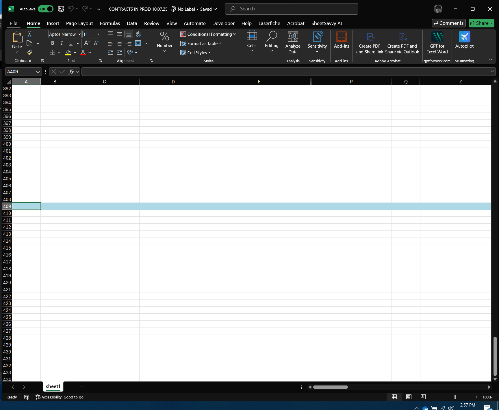

# Excel Row Highlighter Macro

This VBA script highlights the last clicked row in Excel with a light blue fill color.  
The highlight persists even after clicking away from the sheet or switching windows.

Excel doesn’t include this feature by default.
This macro is especially useful when you’re entering or referencing data across multiple windows or applications while keeping Excel visible.  
It prevents losing track of your active row and saves time by keeping your position clearly marked.

## 📄 File
**RowHighlighter.bas** — VBA module containing the macro.

##  How to Use
1. In Excel, press `Alt + F11`.
2. Open the desired sheet under “Microsoft Excel Objects.”
3. Go to **File → Import File...** and select `RowHighlighter.bas`.
4. Save as `.xlsm` and enable macros.

   (Color can be changed via RGB Values in VBA code)

##  Screenshot
Below shows the row highlight effect:



---
##  The Code
```vba
Private Sub Worksheet_SelectionChange(ByVal Target As Range)
    On Error Resume Next

    ' Track the last selected row using a named range called "LastRow"
    If Me.Names("LastRow") Is Nothing Then
        Me.Names.Add Name:="LastRow", RefersTo:="=" & Target.Row
    Else
        Me.Names("LastRow").RefersTo = "=" & Target.Row
    End If

    ' Define the range to which the highlight will apply
    Dim rng As Range
    Set rng = Me.Range("A:Z")  ' Adjust to match your data width

    ' Check if the conditional format already exists
    Dim fc As FormatCondition, hasRule As Boolean
    hasRule = False
    For Each fc In rng.FormatConditions
        If fc.Type = xlExpression Then
            If fc.Formula1 = "=ROW()=LastRow" Then hasRule = True
        End If
    Next fc

    ' If not, create a new conditional format that highlights the active row
    If Not hasRule Then
        rng.FormatConditions.Add Type:=xlExpression, Formula1:="=ROW()=LastRow"
        With rng.FormatConditions(rng.FormatConditions.Count).Interior
            .Pattern = xlSolid
            .Color = RGB(173, 216, 230) ' Light blue highlight
        End With
    End If
End Sub

